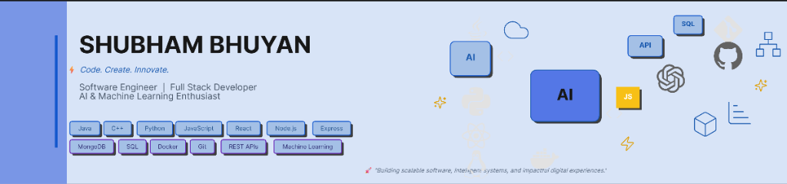

  

  

  
  
  

---

### 👨‍💻 About Me

Hi there! 👋 I'm **Shubham Bhuyan**, a final-year Computer Science & Engineering undergraduate at **Vellore Institute of Technology (VIT Chennai)**. 

I specialize in building full-stack web applications, designing scalable backend architectures, and exploring machine learning & quantum-inspired optimization algorithms.

- 🎓 **Education**: B.Tech in Computer Science & Engineering @ **VIT Chennai**
- 📍 **Location**: Panchkula, Haryana, India
- 💡 **Philosophy**: *"Building scalable software, intelligent systems, and impactful digital experiences."*
- 🔭 **Current Focus**: Advanced Next.js 15 architectures, Distributed Systems, ML surrogate modeling & AI agents.
- 💬 **Ask me about**: React, Next.js, Node.js, Python, Flask, Machine Learning, Prisma ORM, and System Design.

---

### 🛠️ Tech Stack & Skills

<table>
  <tr>
    <td align="center" width="20%"><b>Languages</b></td>
    <td>
      
      
      
      
      
      
      
      
    </td>
  </tr>
  <tr>
    <td align="center"><b>Frontend & UI</b></td>
    <td>
      
      
      
      
    </td>
  </tr>
  <tr>
    <td align="center"><b>Backend & APIs</b></td>
    <td>
      
      
      
      
      
    </td>
  </tr>
  <tr>
    <td align="center"><b>Databases & ORM</b></td>
    <td>
      
      
      
      
      
    </td>
  </tr>
  <tr>
    <td align="center"><b>AI, ML & Quantum</b></td>
    <td>
      
      
      
      
      
    </td>
  </tr>
  <tr>
    <td align="center"><b>DevOps & Tools</b></td>
    <td>
      
      
      
      
      
      
    </td>
  </tr>
</table>

---

### 🚀 Featured Projects

  <table>
    <tr>
      <td width="33%" valign="top">
        <h3 align="center">📦 Last-Mile Delivery Tracker</h3>
        

          
          
          
        

        
Full-stack logistics platform featuring <b>dynamic volumetric weight calculations</b> ($\frac{L \times W \times H}{5000}$), zone-based delivery agent auto-assignment, immutable audit logging, and automated failed-delivery rescheduling.

        

          <a href="https://github.com/curiex7/Projects_shubham"><b>View Repository &rarr;</b></a>
        

      </td>
      <td width="33%" valign="top">
        <h3 align="center">🚇 Metro Congestion Control</h3>
        

          
          
          
        

        
Intelligent transit management system that predicts station passenger flow, detects overcrowding hotspots, and dynamically balances staff resource allocation to ensure commuter safety.

        

          <a href="https://github.com/curiex7/Projects_shubham"><b>View Repository &rarr;</b></a>
        

      </td>
      <td width="33%" valign="top">
        <h3 align="center">🌱 Quantum Genetic Crop Optimizer</h3>
        

          
          
          
        

        
Hybrid Quantum Genetic Algorithm (HQGA) simulator leveraging quantum rotation gates and ML surrogate models to discover optimal climate-resilient crop genotypes under heat and drought stress.

        

          <a href="https://github.com/curiex7/Projects_shubham"><b>View Repository &rarr;</b></a>
        

      </td>
    </tr>
  </table>

---

### 📊 GitHub Activity & Statistics

  
  

  

---

### 📬 Connect With Me

  
  &nbsp;&nbsp;
  

  <i>⚡ "Code. Create. Innovate." &bull; Shubham Bhuyan</i>

